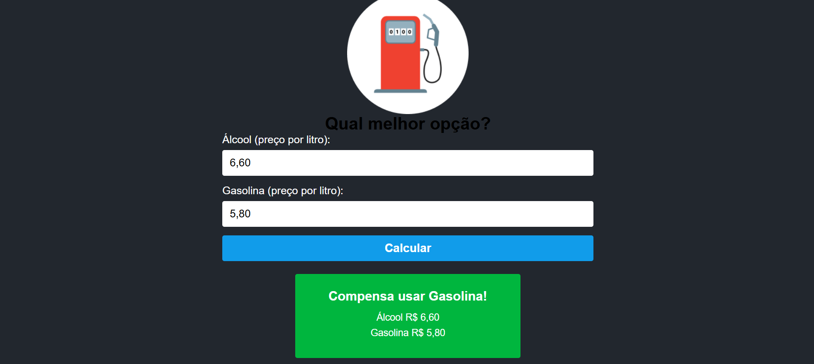

# ⛽ ecoTanque

**ecoTanque** é uma aplicação simples que ajuda usuários a decidir entre abastecer com *Álcool ou gasolina**, com base em um cálculo automático de custo-benefício.

---

## 🚀 Funcionalidades

- Inserir o valor do litro do Álcool e da Gasolina.
- Calcular automaticamente qual combustível é mais vantajoso.
- Exibir o resultado de forma clara e rápida.

---

## 🖼️ Demonstração

 

---

## 🛠️ Tecnologias Utilizadas

- [React](https://reactjs.org/)
- [TypeScript](https://www.typescriptlang.org/)
- [Vite](https://vitejs.dev/)
- [CSS3](https://www.w3.org/Style/CSS/Overview.en.html)

---

## 📦 Como instalar e rodar o projeto

1. Clone o repositório:

```bash
git clone https://github.com/kaah-kz/ecoTanque.git

Entre na pasta do projeto:
cd ecoTanque

Instale as dependências:
npm install

Rode o projeto:
npm run dev

Acesse no navegador:
http://localhost:5173

ecoTanque/
├── node_modules
├── public/              # arquivos estáticos
├── src/
│   ├── assets/          # imagem e logo
│   ├── App.css          # estilos da aplicação
│   ├── App.tsx          # componente principal
│   ├── index.css        # css global do projeto
│   └── main.tsx         # ponto de entrada
├── .gitignore
├── package.json
├── README.md
└── vite.config.ts


🧮 Como o cálculo funciona?
A lógica usada no ecoTanque segue a fórmula comum:

Se (preço do etanol / preço da gasolina) < 0.7 → etanol é mais vantajoso
Caso contrário → gasolina é mais vantajosa 

Contato: karolavila850@gmail.com
